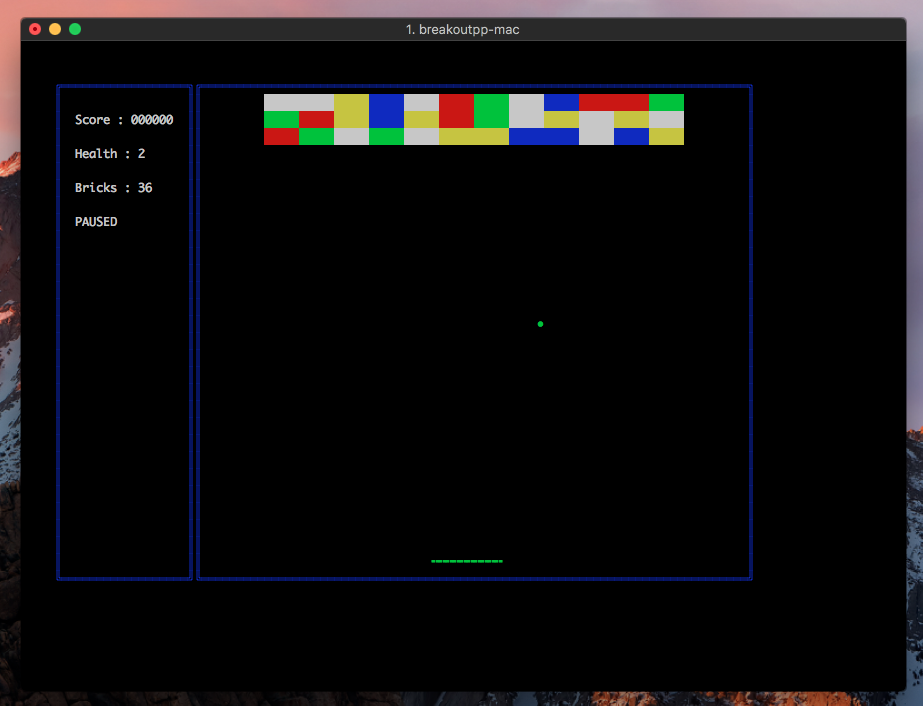

# Breakout++



An implementation of the game "Athari breakout" in cpp

this is me and my friend [Matin](https://github.com/Matin-Ardestani) freshman year first semester project.

### How to play

there is a help menu that describes how you should play the game and how it works but basically :

you can move your paddle with "a" and "d" to catch the ball
you can press "p" to pause the game.

### Build Instruction

to build using cmake :

```shell
git clone https://github.com/farnam-jhn/breakoutpp.git
cd breakout
mkdir build
cd build
mkdir src
touch src/history.txt
cmake ..
cmake --build .
./breakoutpp
```
or you can use normal gcc compiler :

```shell
git clone https://github.com/farnam-jhn/breakoutpp.git
cd breakout
g++ -o breakoutpp main.cpp includes/*.cpp
./breakoutpp
```

### Note

currently only supports unix-like operating systems (e.g Linux, macOS, BSD)
you can compile and play the game in windows using [WSL](https://learn.microsoft.com/en-us/windows/wsl/)
